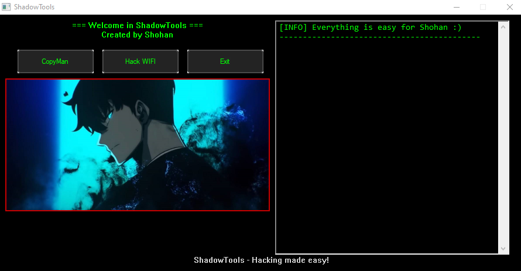
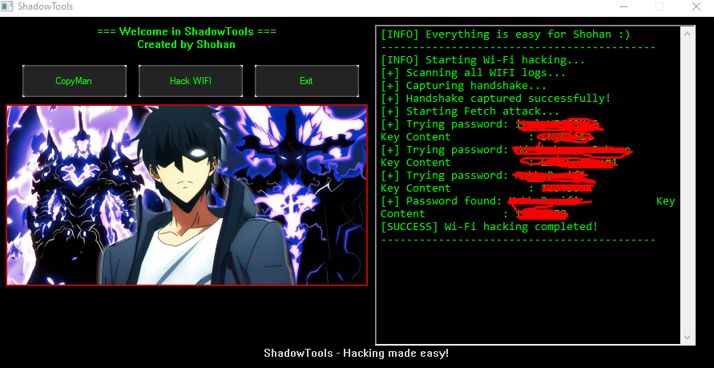

<!-- BANNER -->
<p align="center">
  
</p>


<h1 align="center">⚡ Script Kiddie Ultra Pro Max ⚡</h1>
<p align="center">
  <b>Make cool bro in school 😘<br>
  Make • Build • Use it • Add features • Repeat</b>
</p>

---

## 🧩 About Project-School

My simple Project in school, ShadowTools, finds WiFi logs and displays the real WiFi password. That's for beginners in cybersecurity for fun this role. Also, make for students in school to fun in class like 
---

## 🔥 Features
- ⚙️ Beginner-friendly demos: Win32 C++ UI, mock scanners, and safe command examples.
- 🎯 Logs: All actions are appended to `logs.log` for review and persistence.
- 🚀 “Script Kiddie Ultra Pro Max” design — cool UI, owner-drawn buttons, GDI+ banner images, and neon styling.
- 🎵 Optional audio: Background tracks (offline, local files) to complete the vibe.
- 💻 Editable: You can modify `shadowtools.cpp`, add features, and use them! 💻
- 🕹️ 100% safe & ethical environment, with realistic mock results.

---
  Visual & Vibe✨

Neon-green console text, owner-drawn buttons, and retro terminal vibes.

Rotating banner images and background tunes for that hacker-movie atmosphere.

Clean Win32 demo that demonstrates how UI, logging, and mock tools integrate.

---
## 📸 ScreenShots
<p align="lest">
  
</p>
<p align="left">
  
</p>


---
##  Hangout Highlights
Make awesome videos like this — share them with your friends! 😎 


<https://github.com/user-attachments/assets/5174a27f-5fa2-43f2-9119-91c032de5a87>

---
## 🎛️ **Folder Structure Preview**

```
Project-School/
│
├─ assets_github/
│ └─ ... (all assets for README, banners, etc.)
│
├─ images/
│ ├─ image (1).jpg
│ ├─ image (1).png
│ ├─ image (2).jpg
│ ├─ image (3).jpg
│ ├─ image (4).jpg
│ ├─ image (5).jpg
│ └─ image (6).jpg
│
├─ music/
│ ├─ music (1).mp3
│ ├─ music (2).mp3
│ ├─ music (3).mp3
│ ├─ music (4).mp3
│ ├─ music (5).mp3
│ ├─ music (6).mp3
│ └─ music (7).mp3
│
├─ icon.o
├─ icon.rc
├─ logs.log
├─ shadowtools.cpp
└─ ShadowTools.exe
```
---
## 🤔 What does the program do?
That is run this PowerShell command and show the result on the screen

```
$profiles = netsh wlan show profiles | Select-String "All User Profile" | ForEach-Object { ($_ -split ":")[1].Trim() }

if ($profiles.Count -eq 0) {
    Write-Host "No Wi-Fi profiles found on this PC."
} else {
    $results = foreach ($profile in $profiles) {
        $details = netsh wlan show profile name="$profile" key=clear
        $keyContent = ($details | Select-String "Key Content") -replace ".*:\s*", ""
        [PSCustomObject]@{
            "Wi-Fi Name" = $profile
            "Password"   = if ($keyContent) { $keyContent } else { "No Password / Open Network" }
        }
    }
    $results | Format-Table -AutoSize
}

```

---
## 👋 Author

MD Shohanur Rahman (MR.ShadowMan) — Student, builder, and creative tinkerer 😁.

Made for school students. Stay curious. Stay ethical. 🚀
