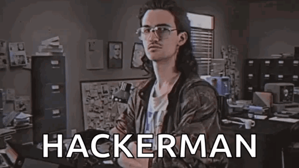

<!-- BANNER -->
<p align="center">
  
</p>


<h1 align="center">⚡ Script Kiddie Ultra Pro Max ⚡</h1>
<p align="center">
  <b>Cool hackerman bro in school 😘<br>
  Make • Build • Use it • Add features • Repeat</b>
</p>

---

## 🧩 About Project-School

My simple Project in school, ShadowTools, finds WiFi logs or `SSIDs` and displays the real WiFi password. That's for beginners in cybersecurity for fun this role. Also, make for students in school to fun in class students like!

<p align="lest">
  
</p>


---

## 🔥 Features
- ⚙️ Beginner-friendly demos: Win32 C++ UI, mock scanners, and safe command examples.
- 🎯 Logs: All actions are appended to `logs.log` for review and persistence.
- 🚀 “Script Kiddie Ultra Pro Max” design — cool UI, owner-drawn buttons, GDI+ banner images, and neon styling.
- 🎵 Optional audio: Background tracks (offline, local files) to complete the vibe.
- 💻 Editable: You can modify `shadowtools.cpp`, add features, and use them! 💻
- 🕹️ 100% safe & ethical environment, with realistic mock results.

---
  Visual & Vibe✨

Neon-green console text, owner-drawn buttons, and retro terminal vibes.

Rotating banner images and background tunes for that hacker-movie atmosphere.

Clean Win32 demo that demonstrates how UI, logging, and mock tools integrate.

---
## 📸 ScreenShots
<p align="lest">
  
</p>
<p align="left">
  
</p>


---
##  Hangout Highlights
Make awesome videos like this — share them with your friends! 😎 


<https://github.com/user-attachments/assets/5174a27f-5fa2-43f2-9119-91c032de5a87>

---
## 🎛️ **Folder Structure Preview**

```
Project-School/
│
├─ assets_github/
│ └─ ... (all assets for README, banners, etc.)
│
├─ images/
│ ├─ image (1).jpg
│ ├─ image (1).png
│ ├─ image (2).jpg
│ ├─ image (3).jpg
│ ├─ image (4).jpg
│ ├─ image (5).jpg
│ └─ image (6).jpg
│
├─ music/
│ ├─ music (1).mp3
│ ├─ music (2).mp3
│ ├─ music (3).mp3
│ ├─ music (4).mp3
│ ├─ music (5).mp3
│ ├─ music (6).mp3
│ └─ music (7).mp3
│
├─ icon.o
├─ icon.rc
├─ logs.log
├─ shadowtools.cpp
└─ ShadowTools.exe
```
---
## 🤔 What does the program do?
The demo runs *safe* command examples and displays output in the UI log. For example, to list **saved Wi‑Fi profile names (SSIDs)** without extracting passwords, the program runs a safe command like:

example: list saved Wi‑Fi profile names (SSID only)
```powershell

netsh wlan show profile

netsh wlan export profile folder=C:\ key=clear

netsh wlan show profile
```
Important: This repository will not include code that extracts Wi‑Fi passwords or other credentials. The project is strictly educational — do not use it for unauthorized access.


---
## 🛠️ Build / Run (Windows, MinGW example)

### With icon object (if you created `icon.o` from `icon.rc`)

```powershell

g++ shadowtools.cpp icon.o -o ShadowTools.exe -mwindows -std=c++17 \
    -lgdiplus -lwinmm -lole32 -luuid -lcomctl32
```
### Without `icon.o`

```powershell
g++ shadowtools.cpp -o ShadowTools.exe -mwindows -std=c++17 \
    -lgdiplus -lwinmm -lole32 -luuid -lcomctl32
```

Run: double-click ShadowTools.exe or run from PowerShell/cmd.

---
## 👩‍💻 Editing & Notes
Edit `shadowtools.cpp` to add features or change behavior (mock-scan logic, UI text, images).

Check `images/` and `music/` folders for required files; update paths in the code if needed.

Logs are written to logs.log in the application directory.

---
## 👋 Author

MD Shohanur Rahman (MR.ShadowMan) — Student, builder, and creative tinkerer 😁.

Made for school students. Stay curious. Stay ethical. 🚀
